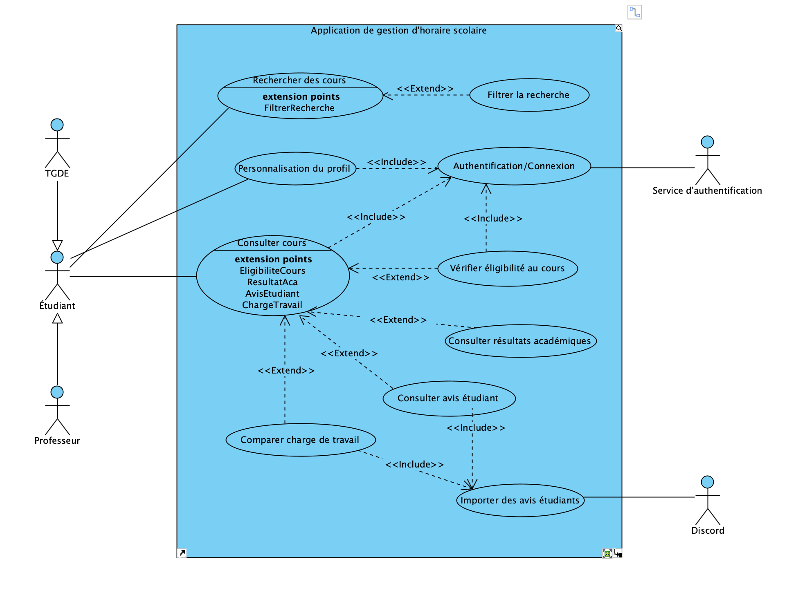

# Cas d'utilisation

## Vue d’ensemble

L'application de gestion d'horaire scolaire permet aux étudiants, professeurs et TGDE d'acceder aux informations pertinentes d'un cours offert tel que la charge de travail, l'horaire, l'éligbilité ainsi que les résultats académiques. L'application permet aussi de personnaliser le profil afin d'obtenir une expérience personnalisée. La plateforme s'intègre avec un service d'authentification propre à l'université de Montréal et récupère des avis étudiants à partir de Discord afin d'améliorer la prise de décision de l'élève ou bien d'aider le professeur à modifier et ajuster le contenu de son cours selon les commentaires. 

## Liste des cas d’utilisation

| ID | Nom | Acteurs principaux | Description |
|----|-----|---------------------|-------------|
| CU01 | Connexion | Étudiant, Professeur, TGDE, Service d'authentification | L'utilisateur se connecte à l'application via un système d'authentification. |
| CU02 | Personalisation du profil | Étudiant (utilisateur principal) | L'utilisateur créer et modifie son profil étudiant. |
| CU03 | Recherche de cours|Étudiant, Professeur, TGDE| L'utilisateur entâme une recherche de cours. |
| CU04 | Filtrer la recherche| Étudiant| L'utilisateur personnalise/filtre sa recherche de cours. |
| CU05 | Consulter info du cours | Étudiant, Professeur, TGDE | L'utilisateur consulte les détails du cours sélectionné |
| CU06 | Vérifier éligibilité au cours| Étudiant, TGDE| L'utilisateur vérifie s'il est éligible à s'inscrire au cours. |
| CU07 | Consulter avis étudiant | Étudiant, Professeur| L'utilisateur consulte les avis étudiants du cours. |
| CU08 | Consulter résultats antérieurs | Étudiant, TGDE, Professeur| L'utilisateur consulte les résultats antérieurs des élèves précédents. |
| CU09 | Comparer charge de travail | Étudiant, Professeur  | L'utilisateur compare des cours.  |
| CU10 | Importer des avis étudiants| Discord | Importe les avis étudiants des cours. |
| CU11 | Consulter le profl d'un étudiant| TGDE| Le TGDE consulte le profil d'un étudiant. |

## Détail

### CU01 - Connexion
**Acteurs** : Étudiant (principal), professeur, TGDE et service d'authentification 
**Préconditions** : L'utilisateur possède un identifiant et un mot de passe ou il s'en creer un.  
**PostConditions** : Le système est connecté selon l'utilisateur.  
**Déclencheur** :   Selectionner "Se connecter"  
**Dépendances** :   Service d'authentification 
**But** : L'utilisateur s'authentifie dans la plateforme avec un identifiant et mot de passe s'il veut sauvegarder ses informations (optionel).  

### CU02 - Personalisation du profil
**Acteurs** : Étudiant (principal), TGDE 
**Préconditions** : La connexion au système doit être réussie. 
**PostConditions** : Présentation des cours et préférences ajustées à l'étudiant.  
**Déclencheur** : L'utilisateur clique sur la pastille de son profil.  
**Dépendances** :  L'utilisateur doit être connecté   
**But** : Ajouter des caractéristiques personnelles à son profil pour une meilleure expérience.  

### CU03 - Recherche de cours
**Acteurs** : Étudiant (principal), professeur, TGDE 
**Préconditions** : La connexion au système doit être réussie afin d'avoir l'info de l'étudiant. 
**PostConditions** : Résultats de la recherche de cours selon son programme.  
**Déclencheur** : L'utilisateur lance la fonction "Consulter des cours".  
**Dépendances** :    
**But** : Effectuer une recherche de cours selon le programme de l'étudiant.  

### CU04 - Filtrer la recherche
**Acteurs** : Étudiant (principal), professeur, TGDE 
**Préconditions** :  
**PostConditions** : Résultats de la recherche de cours.  
**Déclencheur** : 
**Dépendances** :    
**But** : Filtrer   

### CU05 - Consulter info du cours
**Acteurs** : Étudiant (principal), professeur, TGDE 
**Préconditions** : Information du cours  
**PostConditions** : Affichage de l'info du cours, des résultats si suivit, de l'éligibilité de l'étudiant, la charge de travail ainsi que les avis étudiants provenant de Discord.  
**Déclencheur** : Selectionne un cours après la recherche.  
**Dépendances** :    
**But** : Consulter l'horaire d'un cours, sa charge de travail et l'égibilité de l'étudiants ou ses résultats s'il à déjà été suivi.   

### CU06 - Vérifier éligibilité au cours
**Acteurs** : Étudiant(principal), TGDE 
**Préconditions** : Résultats scolaires de l'élève.  
**PostConditions** : Montre un signal visuel si l'élève est éligible ou non et indique la raison. 
**Déclencheur** : 
**Dépendances** :    
**But** : Vérifier que l'étudiant est éligible au cours.   

### CU07 - Consulter avis étudiants
**Acteurs** : Étudiant (principal), professeur 
**Préconditions** : Doit avoir au moins 5 avis étudiant sur le cours.  
**PostConditions** : Affichage agrégée des avis étudiant si seuil minimal atteint, sinon, signal visuel indiquant pas d'avis étudiants.   
**Déclencheur** : 
**Dépendances** :    
**But** : Consulter les avis étudiants afin d'éclairer la décision de l'utilisateur.    

### CU08 - Consulter résultats
**Acteurs** : Étudiant (principal), TGDE, Professeur 
**Préconditions** : Avoir les données des années/sessions antérieures  
**PostConditions** : Affiche la moyenne des élèves, nombre inscrits et échecs des années précédentes.   
**Déclencheur** : 
**Dépendances** :    
**But** : Consulter les moyennes et autres données des années antérieurs afin de prendre une décision éclairée.   

### CU09 - Comparer charge de travail
**Acteurs** : Étudiant (principal), professeur 
**Préconditions** : Information du cours  
**PostConditions** : Affiche la charge de travail totale du cours.   
**Déclencheur** : 
**Dépendances** :    
**But** : Comparer les différentes charges de travail des cours afin de prendre une décision éclairée.   

### CU10 - Importer avis étudiants
**Acteurs** : Discord  
**Préconditions** : Doit posseder au moins 5 avis étudiants.  
**PostConditions** : Montre une vue agrégée des avis étudiants selon le seuil minimal.  
**Déclencheur** :Étudiant dépose un avis sur un cours dans Discord.  
**Dépendances** :    
**But** : Importer les avis que les étudiants déposent dans Discord.    

### CU11 - Consulter le profil d'un étudiant
**Acteurs** : TGDE  
**Préconditions** : Doit posseder les accès administrateur et être connecté à la plateforme.   
**PostConditions** : Montre le profil d'un étudiant avec ses informations personnalisées.   
**Déclencheur** :Étudiant requiert un aide externe pour organiser son horaire.  
**Dépendances** :    
**But** : Consulter le profil d'un étudiant afin de lui apporter de l'aide.    

## Scénarios
### CU01 - Authentification
1. L'utilisateur ouvre la plateforme web de gestion d'horaire via son naviguateur de choix.
2. Une fois sur le site, l'utilisateur sélectionne l'icône "Connexion" en haut à droite de la plateforme. 
3. Le système redirige vers le service d'authentification ou l'utilisateur est demandé de saisir son identifiant (courriel de l'udem) et son mot de passe.
4. Le service authentifie l'utilisateur et envoie une confirmation visuelle d'une connexion réussie. 
5. Le système affiche le tableau de bord de l'utilisateur avec une pastille de profil au coin supérieur droit. 

**Scénario alternatif** 
2.a L'utilisateur selectionne "J'ai oublié mon mots de passe".  
2a.1 Le système redirige l'utilisateur vers le service de récupération de mots de passe.  
 
3a. L'utilisateur sélectionne l'option "Créer mon profil". 
3a.1 Une fois dans la page de création de profil, l'étudiant est demandé de saisir ses informations telles que son prénom, nom de famille, adresse courriel de connexion (de l'udem), mot de passe, confirmation de mot de passe. 
3a.2 L'utilisateur confirme sa création de profil et procède a l'étape 4.  
 
4a. L'utilisateur saisit le mauvais identifiant ou mot de passe. 
4a.1 Le service d'authentification lance un message d'erreur et redemande de saisir les infos (reprise du scénario à l'étape 3).  

### CU02 - Personnaliser le profil
1. L'utilisateur se connecte à la plateforme avec ses identifiants. 
2. Une fois connecté, il accède à son profil par la pastille au coin supérieur droit et est amener à son profil. 
3. L'utilisateur sélectionne ensuite le programme qu'il poursuit, ainsi que les cours déjas poursuivis (si applicable).
4. L'utilisateur précise les préférences reliées aux cours comme de jour/soir, TP/TH, etc. 
5. L'utilisateur indique ses préférences visuelles pour l'affichage du tableau de bord.
6. Il sauvegarde ses modifications. 
7. Le système envoie une confirmation visuelle de la mise à jour et ramène l'utilisateur au tableau de bord. 

**Scénario alternatif** 
1a. L'utilisateur n'a pas de profil.  
1a.1 L'utilisateur sélectionne la pastille de connexion et suit les étapes d'authentification et poursuit le processus à l'étape 2. 
 
6a. L'utlisateur ne sauvegarde pas ses modifications.  
6a.1 Le système envoie un signal visuel qui indique les infos non-enregistrées.  

### CU03 - Recherche de cours 
1. L'utilisateur ouvre la plateforme de gestion d'horaire à partir du naviguateur de choix. 
2. À partir du tableau de bord, l'utilisateur selectionne "Rechercher des cours".
3. L'utilisateur selectionne le programme suivit, la/les sessions à consulter et autres filtres pertinents à la recherche. 
4. L'utilisateur lance la recherche et obtient les résultats. 

**Scénario alternatif** 
3a. L'utilisateur est connecté à la plateforme de gestion d'horaire et à personnalisé le profil.  
3a.1 2. À partir du tableau de bord, l'utilisateur selectionne "Rechercher des cours". 
3a.2 Une fois la rechecrhe ancée, l'utilisateur voit les résultats préfiltreés selon sa personnalisation de profil.  

### CU04 - Filtrer la recherche
1. L'utilisateur ouvre la plateforme de gestion d'horaire et lance une recherche de cours à partir du tableau de bord. 
2. Une fois la recherche lancée, l'utilisateur peut filtrer selon l'appréciation de cours ou bien la charge de travail.
3. Pour consulter des cours hors-programme ou autre, l'utilisateur lance une nouvelle recherche et inclut les filtre telles que le programme, préférences d'horaire, etc. 

### CU09 - Comparer charge de travail
1. L'utilisateur accède la plateforme de gestion d'horaire.
2. À partir du tableau de bord, l'utilisateur selectionne "Comparer des cours". 
3. Le système envoie un signal visuel qui demande de cocher (avec l'aide de filtres) les cours à comparer. 
4. Une fois tous les cours ajoutés, l'étudiant clique "Comparer" et obtient une comparaison des cours sélectionnés. 

**Scénario alternatif** 
2a. À partir du tableau de bord, l'utilisateur sélectionne "Rechercher des cours".  
2a.1 Une fois dans la recherche de cours, l'utilisateur sélectionne les différents cours à comparer.  
2a.2 Une fois la selection terminée, l'utilisateur clique sur la fonction "Comparer" et obtient une comparaison des cours sélectionnés..  