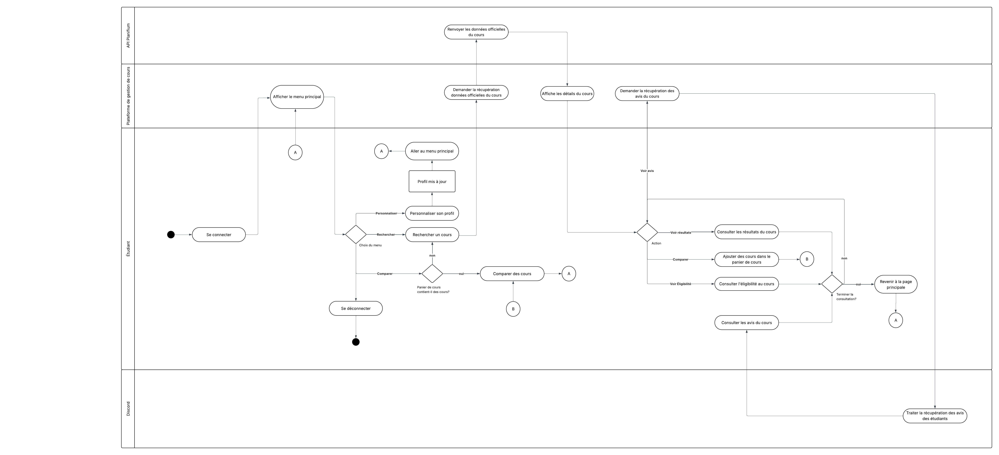

# Flux principaux

## Objectif

Décrire les flux d’interaction entre les acteurs et le système.

## Diagrammes

# Description du flux d'activités principal

## Connexion et navigation

L'étudiant se connecte à la plateforme avec son compte. Une fois connecté, il arrive sur le menu principal où il peut choisir quoi faire : chercher des cours, modifier son profil, comparer des cours ou se déconnecter.

## Profil étudiant

Si l'étudiant veut personnaliser son profil (préférences théorie/pratique, centres d'intérêt, etc.), il peut le faire depuis le menu. Les changements sont sauvegardés et il revient au menu principal après.

## Recherche de cours

Quand l'étudiant cherche un cours (par code ou mots-clés), la plateforme interroge l'API Planifium pour récupérer les infos officielles : titre, crédits, prérequis, horaires. Les résultats s'affichent avec les détails du cours.

## Consultation détaillée

Pour un cours qui l'intéresse, l'étudiant peut voir :

- **Résultats académiques** : moyenne du cours, nombre d'étudiants inscrits, taux d'échec (données stockées dans notre base)
- **Avis étudiants** : commentaires et notes de difficulté/charge de travail collectés via Discord (affichés seulement si au moins 5 avis)
- **Éligibilité** : vérification automatique si l'étudiant remplit les prérequis

## Panier et comparaison

L'étudiant peut ajouter des cours dans un panier pour les comparer plus tard. Quand il a plusieurs cours dans son panier, il peut lancer une comparaison qui affiche côte à côte : la charge de travail totale, les difficultés, les horaires qui se chevauchent, etc. Ça l'aide à choisir sa combinaison de cours pour la session.

## Fin de session

À tout moment, l'étudiant peut revenir au menu principal ou se déconnecter. Sa session se termine et les données temporaires (comme le panier) sont effacées.

## Vue d'ensemble de l'intégration

Le système connecte trois sources :

- **API Planifium** : données officielles des cours (externe)
- **Bot Discord** : collecte des avis étudiants (externe)
- **Notre plateforme** : affiche tout de façon claire pour aider l'étudiant à choisir

