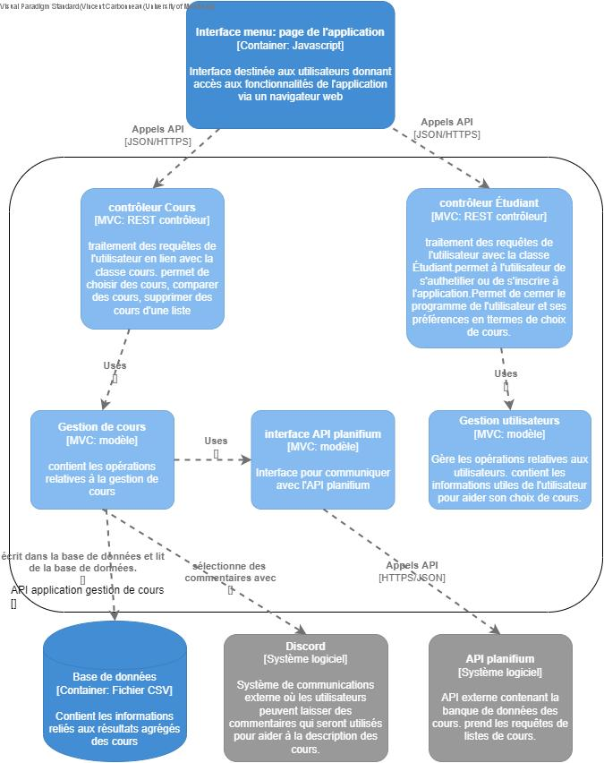

# Architecture du système

## Vue d’ensemble

La conception du système utilise une architecture structurée autour d'une séparation claire entre modèle, contrôleurs et vues (MVC), ce qui favorise une compréhension simple du fonctionnement global et une évolue simple du logiciel. Elle adopte une architecture monolithique en couches exposant une API REST. Le choix d'un modèle monolithique s'est fait par le fait que le projet est crée par une petite équipe et le modèle présente une simplkcité de développement et de déploiement. 

Normalement, la plateforme couvre un domaine fonctionnel bien délimité, limitant ainsi les fortes dépendances. On utilise l'API REST en tant qu'interface d'accès aux fonctionnalités métiers en permetant à l'utilisateur d'efectuer des appels HTTP. 

## Composants principaux
### Module d’authentification:
  - **Classes clés :** `AuthentificationController`, `VueAuthentification`, `Utilisateur`
  - **Rôle :** Gestion de la connexion/déconnexion à la plateforme, créé une session utilisateur et accès aux fonctionnalités de la plateforme. 
  - **Responsabilité :** vérifier les identifiants, créer la session utilisateur.
 
### Gestion des utilisateurs:
  - **Classes clés :** `Utilisateur`, `Étudiant`, `ProfilController`, `VueProfil`
  - **Rôle :** Gestion du profil étudiant (rpogramme, préférences, filtres, cours effectués)
  - **Responsabilités :** Encapsuler les données et oopérations qui sont liées aux utilisateurs et fournir des opérsations pour modifier ou sauvegarder le profil.

### Interface (frontend)
  - **Classes clés :** `VueProfil`, `VueSelectionCours`,`VueRechrcherCours`,`VueConsulterCours`,`VueComparaisonCours`, `Menu`, `App`
  - **Rôle :** Présentation des informations et interaction avec l'utilisateur (affiché les listes de cours, formulaire de recherche, tableau de comparaison, etc)
  - **Responsabilités :** Appeler les contrôleurs via l'API REST, récupérer les résultats et les afficher dans l'interface 

### API backend
  - **Classes clés :** Contrôleurs métiers (`SelectionController`, `RechecrherCoursController`, `ConsulterCoursController`, `ComparaisonController`) et modèle de domaine (`Cours`, `SelectionCours`, `RechercheCours`, `RésultatsAgrégées`, `Avis`, `Horaire`, etc)
  - **Rôle :** Implémentater la logique applicative (Sélection, recherche, comparason, calcul de charge de travail, Éligibilté, etc)
  - **Responsabilités :** Intégrer les sources de données 

## Communication entre composants
**Mécanismes d’échange : appels HTTP**
- Principalement GET, POST, PUT/DELETE
- Chaque vues invoque les endpoints correspondants.

**Format des données : JSON**
Les entiers métiers (par exemple, `Cours`, `Étudiant`, `RésultatsAgrégées`,`TableauComparaison`) sont sérialisés en JSON et renvoyés au client, ce qui facilite l'interopérabilité avec d'Autres clients ou services potentiels (par exemple, Discord, Les résultats scolaires, etc).

## Diagramme d’architecture (Modèle C4)

