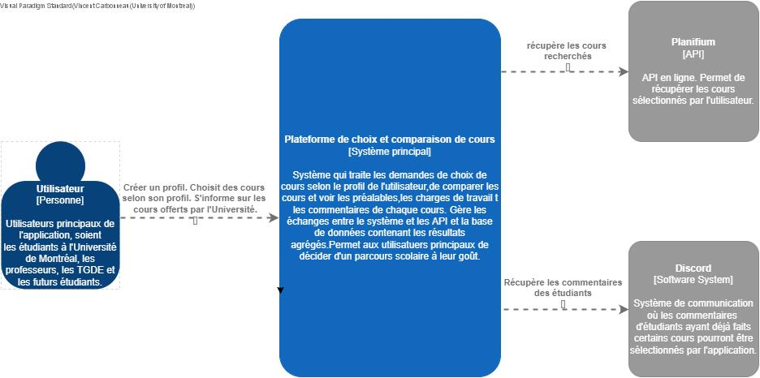
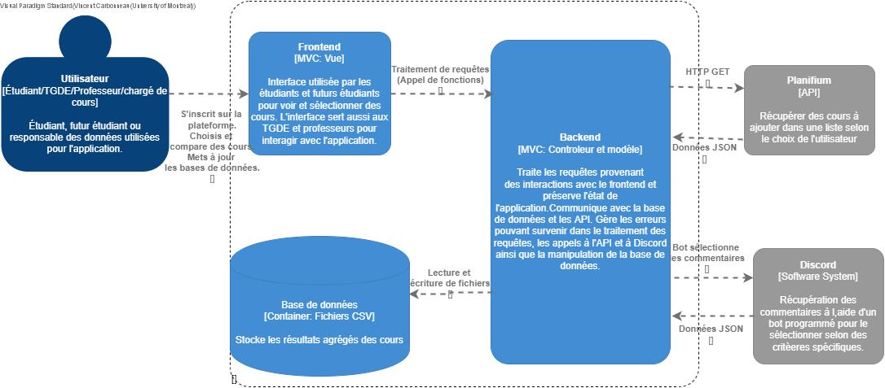

# Architecture du système

## Vue d’ensemble
Le projet mise sur une architecture client-serveur de style modèle-vue-controlleur avec le backend en architecture API REST. Cet API REST est développée de  manière orienté objet avec une approche modulaire.le choix de ce type d'architecture correspond le mieux pour répondre aux exigences du client surtout en ce qui attrait à la clarté de l'application. le backend étant une API REST rend l'application facile à comprendre et compatible avec la majorité des langages informatiques. De plus, l'application est facile à tester avec un logiciel comme Postman, ce qui donne une réduction du coût de validation. L'interface du client est aussi séparée du backend ''serveur'', cette indépendance assure un couplage faible entre la vue et le controlleur. La séparation en modules permet aussi un couplage faible et une forte cohésion. Il est aussi plus facile de détecter les problèmes d'une partie du code avec cette approche contrairement à une architecture monolithique.Une API REST utilise aussi le protocole d'appels HTTP qui fourni une cache intégrée, ce qui améliore les performances de l'application.L'application est aussi plus stable puisque ce type d'architecture est utilisé partout.

## Composants principaux

- Liste des modules ou services :
  - Module Utilisateur
  - Module qui gère la sélection des cours.
  - Module d'interface pour la section vue
  - interface de communication avec un bot discord.

## Communication entre composants
Les échanges entre les composantes se font quasi exclusivement sous forme d'appels HTTP sauf pour quelques appels entre le bot et discord qui se font en format Websocket. Les données sont en format JSON.

## Diagramme d’architecture (Modèle C4)

